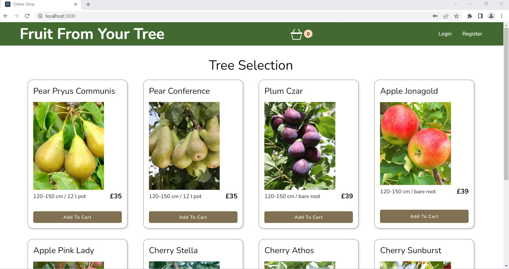
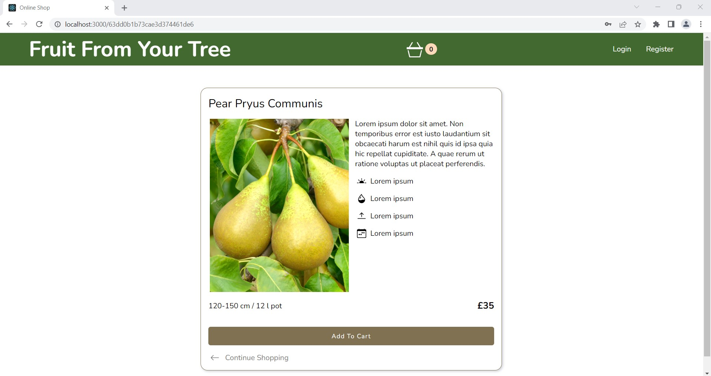
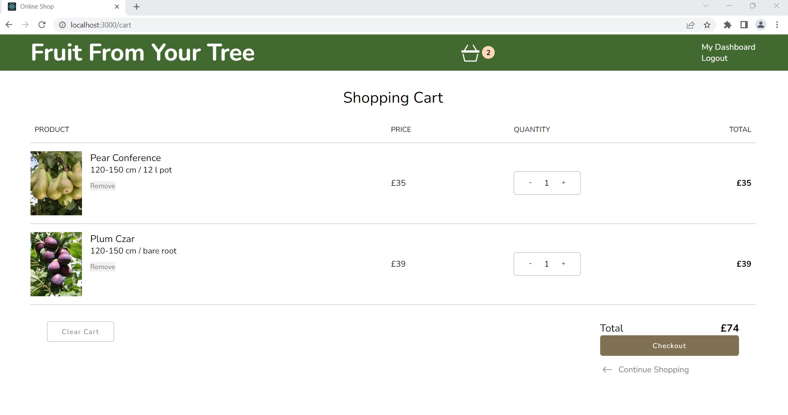
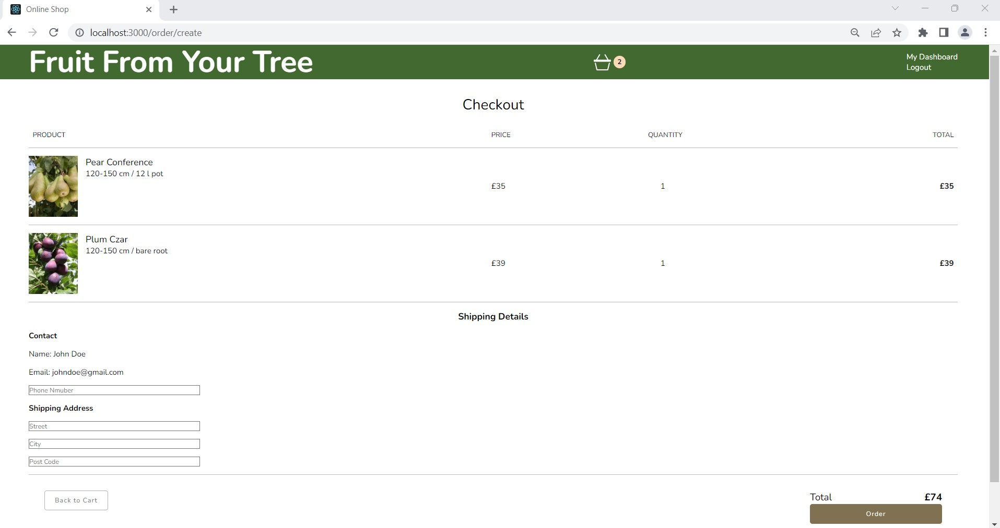
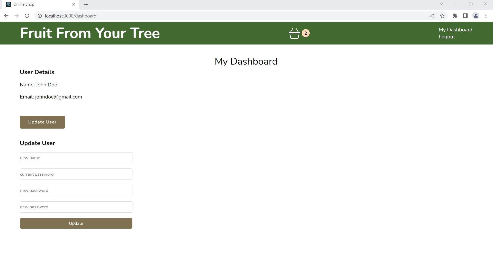
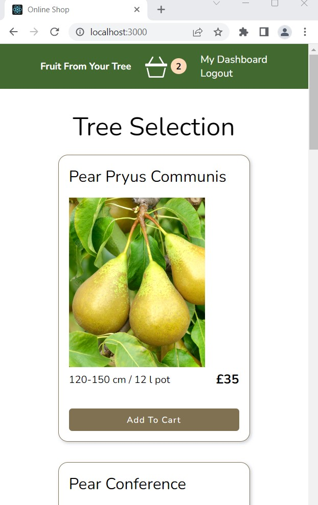

# ecommerce-fullstack-app

## Description
The aim of this project is to design a full stack e-commerce web app having the user interface communicating with the API. My web app is called "Fruit From Your Tree" a fictional web shop selling fruit trees.

## Technologies:
### Backend
* JavaScript
* Express
* Node.js
* MongoDB and Mongoose
* JWT, Bcrypt, dotenv

### Frontend
* HTML
* CSS
* JavaScript
* React
* Redux

## Features

* On home page products are fetched from database
* By clicking on a specific product a detailed product card is rendered
* User can add items to cart, change items and quantities
* To check-out user need to login or register. User details stored in database
* Cart checkout and order creation. Order details are stored in database
* Dashboard area to manage user details

## Screenshots
Home Page <br>
 <br>

Product Details <br>
 <br>

Cart <br>
 <br>

Checkout <br>
 <br>

Dashboard <br>
 <br>

Mobile Home Page <br>
 <br>

## Running the Application Locally

1. Clone this repository:

2. Install dependencies both in backend and frontend directories:
```
npm install
```

3. Add missing environment variables ref `/EXAMPLE.env` and rename the file to `.env`.

4. In the frontend directory run:
```
npm start
```

5. In the backend directory run:
```
npm run dev
```
